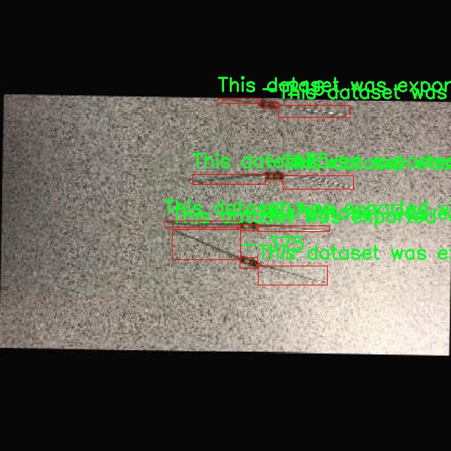

# 电阻器检测检测系统源码分享
 # [一条龙教学YOLOV8标注好的数据集一键训练_70+全套改进创新点发刊_Web前端展示]

### 1.研究背景与意义

项目参考[AAAI Association for the Advancement of Artificial Intelligence](https://gitee.com/qunmasj/projects)

项目来源[AACV Association for the Advancement of Computer Vision](https://kdocs.cn/l/cszuIiCKVNis)

研究背景与意义

随着电子技术的迅猛发展，电阻器作为电子元件中不可或缺的一部分，其检测与识别的准确性和效率愈发重要。电阻器在电路中起着关键的作用，影响着电路的性能和稳定性。因此，构建一个高效、准确的电阻器检测系统，能够在电子制造、维修及自动化测试等领域发挥重要作用。传统的电阻器检测方法多依赖人工识别和测量，效率低下且容易出现人为错误。近年来，计算机视觉和深度学习技术的迅速发展为电阻器的自动检测提供了新的解决方案。

在众多的目标检测算法中，YOLO（You Only Look Once）系列因其高效性和实时性而备受关注。YOLOv8作为该系列的最新版本，结合了更为先进的网络结构和优化算法，能够在保证检测精度的同时，显著提高检测速度。然而，针对特定应用场景，如电阻器检测，YOLOv8的标准模型可能无法充分发挥其潜力。因此，基于YOLOv8的改进，针对电阻器的特征进行模型优化，将有助于提升检测的准确性和效率。

本研究所使用的数据集包含1700张电阻器图像，涵盖了四个类别，数据集的多样性和丰富性为模型的训练提供了良好的基础。数据集的构建采用了半合成的方法，这种方法不仅能够提高数据的多样性，还能有效减少因数据不足而导致的过拟合问题。通过roboflow平台导出的数据集，确保了数据的标注准确性和一致性，为后续的模型训练和评估奠定了坚实的基础。

本研究的意义在于，通过改进YOLOv8模型，结合特定的电阻器检测需求，开发出一种高效的电阻器检测系统。这一系统不仅能够提升电阻器的检测精度，还能在实际应用中实现实时检测，为电子制造和维修提供技术支持。此外，基于该系统的研究成果，能够为其他电子元件的检测提供借鉴，推动计算机视觉技术在电子行业的应用。

综上所述，基于改进YOLOv8的电阻器检测系统的研究，不仅具有重要的理论意义，还具有广泛的应用前景。通过深入探索深度学习在电阻器检测中的应用，能够为电子元件的自动化检测提供新的思路和方法，推动电子制造行业的智能化发展。同时，该研究也为后续相关领域的研究提供了基础，具有重要的学术价值和实际应用意义。

### 2.图片演示


##### 注意：由于此博客编辑较早，上面“2.图片演示”和“3.视频演示”展示的系统图片或者视频可能为老版本，新版本在老版本的基础上升级如下：（实际效果以升级的新版本为准）

  （1）适配了YOLOV8的“目标检测”模型和“实例分割”模型，通过加载相应的权重（.pt）文件即可自适应加载模型。

  （2）支持“图片识别”、“视频识别”、“摄像头实时识别”三种识别模式。

  （3）支持“图片识别”、“视频识别”、“摄像头实时识别”三种识别结果保存导出，解决手动导出（容易卡顿出现爆内存）存在的问题，识别完自动保存结果并导出到tempDir中。

  （4）支持Web前端系统中的标题、背景图等自定义修改，后面提供修改教程。

  另外本项目提供训练的数据集和训练教程,暂不提供权重文件（best.pt）,需要您按照教程进行训练后实现图片演示和Web前端界面演示的效果。

### 3.视频演示

[3.1 视频演示](https://www.bilibili.com/video/BV1afshecEEq/)

### 4.数据集信息展示

##### 4.1 本项目数据集详细数据（类别数＆类别名）

nc: 3
names: ['-', 'Resistor Detection  - v5 Half-Synthetic', 'This dataset was exported via roboflow.com on March 7- 2023 at 3-57 AM GMT']


##### 4.2 本项目数据集信息介绍

数据集信息展示

在现代计算机视觉领域，数据集的质量和多样性对模型的训练效果至关重要。本研究所使用的数据集名为“Resistor Detection”，旨在为改进YOLOv8的电阻器检测系统提供高质量的训练样本。该数据集包含三类主要信息，分别是类别数量、类别名称以及数据集的来源和导出时间。这些信息不仅为模型的训练提供了基础数据支持，也为后续的实验分析和结果评估奠定了坚实的基础。

首先，数据集的类别数量为3，表明该数据集在电阻器检测任务中涵盖了多个相关的分类。这种多样性使得模型在训练过程中能够学习到不同类别之间的特征差异，从而提高其在实际应用中的识别准确率。具体来说，数据集中包含的类别名称为“Resistor Detection - v5 Half-Synthetic”，这一名称暗示了数据集的构建方法和特性。通过“Half-Synthetic”这一描述，可以推测该数据集可能结合了真实图像和合成图像，以增强数据的多样性和丰富性。这种方法不仅能够有效增加训练样本的数量，还能在一定程度上降低模型对特定背景或光照条件的依赖，使得训练出的模型在各种环境下都能保持较高的检测性能。

此外，数据集的导出信息显示，该数据集是在2023年3月7日的GMT时间3:57 AM导出的。这一时间戳不仅为研究人员提供了数据集的版本控制信息，也为后续的研究和应用提供了时间参考。随着时间的推移，电阻器的种类和外观可能会发生变化，因此，了解数据集的导出时间对于评估其在当前技术环境下的适用性至关重要。尤其是在快速发展的电子元器件领域，及时更新和维护数据集是确保模型有效性的关键。

通过使用“Resistor Detection”数据集，研究人员能够利用YOLOv8这一先进的目标检测算法，针对电阻器的特征进行深入学习和优化。YOLOv8作为一种高效的实时目标检测模型，其在处理速度和准确性方面均表现出色，适合于各种实际应用场景。结合“Resistor Detection”数据集，研究人员可以通过调整模型参数、优化网络结构等方式，进一步提升电阻器检测的性能。这不仅有助于提高电路设计和生产过程中的自动化水平，也为电子元器件的质量检测提供了强有力的技术支持。

总之，“Resistor Detection”数据集为电阻器检测系统的研究提供了宝贵的资源，其多样的类别和丰富的样本信息为模型的训练和优化奠定了基础。随着研究的深入，期待该数据集能够为电阻器检测技术的发展做出积极贡献，并推动相关领域的进步与创新。





### 5.全套项目环境部署视频教程（零基础手把手教学）

[5.1 环境部署教程链接（零基础手把手教学）](https://www.ixigua.com/7404473917358506534?logTag=c807d0cbc21c0ef59de5)


[5.2 安装Python虚拟环境创建和依赖库安装视频教程链接（零基础手把手教学）](https://www.ixigua.com/7404474678003106304?logTag=1f1041108cd1f708b01a)

### 6.手把手YOLOV8训练视频教程（零基础小白有手就能学会）

[6.1 手把手YOLOV8训练视频教程（零基础小白有手就能学会）](https://www.ixigua.com/7404477157818401292?logTag=d31a2dfd1983c9668658)

### 7.70+种全套YOLOV8创新点代码加载调参视频教程（一键加载写好的改进模型的配置文件）

[7.1 70+种全套YOLOV8创新点代码加载调参视频教程（一键加载写好的改进模型的配置文件）](https://www.ixigua.com/7404478314661806627?logTag=29066f8288e3f4eea3a4)

### 8.70+种全套YOLOV8创新点原理讲解（非科班也可以轻松写刊发刊，V10版本正在科研待更新）

由于篇幅限制，每个创新点的具体原理讲解就不一一展开，具体见下列网址中的创新点对应子项目的技术原理博客网址【Blog】：


[8.1 70+种全套YOLOV8创新点原理讲解链接](https://gitee.com/qunmasj/good)

### 9.系统功能展示（检测对象为举例，实际内容以本项目数据集为准）

图9.1.系统支持检测结果表格显示

  图9.2.系统支持置信度和IOU阈值手动调节

  图9.3.系统支持自定义加载权重文件best.pt(需要你通过步骤5中训练获得)

  图9.4.系统支持摄像头实时识别

  图9.5.系统支持图片识别

  图9.6.系统支持视频识别

  图9.7.系统支持识别结果文件自动保存

  图9.8.系统支持Excel导出检测结果数据


### 10.原始YOLOV8算法原理

原始YOLOv8算法原理

YOLOv8算法是Ultralytics公司在2023年推出的最新版本，标志着YOLO系列在目标检测领域的一次重要进化。YOLOv8在设计上延续了YOLO系列的核心理念，即追求高效、准确和易用的目标检测，同时在网络结构和算法实现上进行了诸多创新和改进，使其在处理复杂场景和多样化目标时表现出更强的能力。

首先，YOLOv8的输入模块设计上采用了640x640的标准输入尺寸，但为了适应实际应用中不同长宽比的图像，YOLOv8引入了自适应图片缩放技术。这一技术的核心在于根据图像的长边进行缩放，并对短边进行填充，最大限度地减少信息冗余，从而提高了目标检测的速度和精度。此外，在训练过程中，YOLOv8采用了Mosaic数据增强技术，通过将四张不同的图像随机缩放并拼接成一张新图像，促使模型学习到更多样化的特征和背景信息，从而有效提升了模型的泛化能力和预测精度。

在网络结构方面，YOLOv8的主干网络（Backbone）进行了显著的改进。YOLOv8参考了YOLOv7中的ELAN模块，采用了C2F模块替代了YOLOv5中的C3模块。C2F模块通过并行处理多个梯度流分支，既保持了模型的轻量化，又获得了更丰富的特征信息。这种设计使得YOLOv8在处理不同规模的目标时，能够更有效地提取特征，进而提高检测精度。

YOLOv8的Neck部分同样进行了优化。与YOLOv5相比，YOLOv8去除了两次上采样之前的1x1卷积连接层，直接对Backbone不同阶段输出的特征进行上采样。这一改进不仅简化了网络结构，还提升了特征融合的效率，使得不同尺度的特征能够更好地结合，从而提高了检测的准确性。

在Head部分，YOLOv8的变化尤为显著。它从Coupled-Head（耦合头）转变为Decoupled-Head（解耦头），实现了检测和分类过程的解耦。这一设计使得模型在进行类别预测和边界框回归时，能够分别优化各自的损失函数，从而提高了整体性能。在损失函数的设计上，YOLOv8取消了Obj分支，采用BCELoss（Binary Cross Entropy Loss）进行分类损失计算，而在边界框回归分支中则使用了DFL（Distribution Focal Loss）和CIoULoss（Complete Intersection over Union Loss），使得模型能够更快地聚焦于标签附近的区域，提高了定位精度。

更为重要的是，YOLOv8摒弃了传统的Anchor-Based（基于锚框）检测方法，转而采用Anchor-Free（无锚框）的方法。这一转变不仅简化了模型的设计，减少了计算复杂度，还提高了模型在不同目标尺寸和形状下的适应能力。YOLOv8将目标检测转化为关键点检测，避免了在训练前对锚框进行预设和聚类的繁琐过程，从而增强了模型的泛化能力。

通过以上的设计和改进，YOLOv8在多个目标检测任务中展现出了卓越的性能。尤其是在COCOval2017数据集上的表现，YOLOv8在单模型单尺度测试中取得了令人瞩目的成绩，显示出其在目标检测、图像分割和图像分类等多种应用场景中的广泛适用性。值得注意的是，尽管YOLOv8在性能上取得了显著提升，但在复杂环境下，尤其是小目标检测方面仍然存在一定的挑战。因此，针对这些不足，后续的研究和改进将继续围绕提升小目标的检测能力和降低背景干扰展开。

总的来说，YOLOv8作为YOLO系列的最新版本，通过一系列创新的设计和优化，进一步推动了目标检测技术的发展。其高效的网络结构、灵活的输入处理方式以及先进的损失函数设计，使得YOLOv8在处理复杂视觉任务时具备了更强的竞争力。随着技术的不断进步，YOLOv8无疑将在未来的计算机视觉应用中发挥越来越重要的作用。


### 11.项目核心源码讲解（再也不用担心看不懂代码逻辑）

#### 11.1 code\ultralytics\utils\benchmarks.py

以下是对代码中最核心部分的提炼和详细中文注释：

```python
import time
import numpy as np
import pandas as pd
from ultralytics import YOLO
from ultralytics.utils import select_device, check_requirements, check_yolo, file_size, TQDM

def benchmark(
    model='yolov8n.pt', data=None, imgsz=160, half=False, int8=False, device="cpu", verbose=False
):
    """
    基准测试YOLO模型在不同格式下的速度和准确性。

    参数:
        model (str | Path | optional): 模型文件或目录的路径，默认为'yolov8n.pt'。
        data (str, optional): 用于评估的数据集，默认为None。
        imgsz (int, optional): 基准测试的图像大小，默认为160。
        half (bool, optional): 如果为True，则使用半精度模型，默认为False。
        int8 (bool, optional): 如果为True，则使用int8精度模型，默认为False。
        device (str, optional): 运行基准测试的设备，可以是'cpu'或'cuda'，默认为'cpu'。
        verbose (bool | float | optional): 如果为True或浮点数，则根据给定的指标断言基准测试通过，默认为False。

    返回:
        df (pandas.DataFrame): 包含每种格式的基准测试结果的DataFrame，包括文件大小、指标和推理时间。
    """
    
    # 设置Pandas显示选项
    pd.options.display.max_columns = 10
    pd.options.display.width = 120
    device = select_device(device, verbose=False)  # 选择设备
    model = YOLO(model) if isinstance(model, (str, Path)) else model  # 加载YOLO模型

    results = []  # 存储结果
    start_time = time.time()  # 记录开始时间

    # 遍历不同的导出格式
    for i, (name, format, suffix, cpu, gpu) in export_formats().iterrows():
        emoji, filename = "❌", None  # 默认导出状态
        try:
            # 确保支持的设备和格式
            assert i != 9 or LINUX, "Edge TPU export only supported on Linux"
            if i in {5, 10}:  # CoreML和TF.js
                assert MACOS or LINUX, "export only supported on macOS and Linux"
            if "cpu" in device.type:
                assert cpu, "inference not supported on CPU"
            if "cuda" in device.type:
                assert gpu, "inference not supported on GPU"

            # 导出模型
            filename = model.export(imgsz=imgsz, format=format, half=half, int8=int8, device=device, verbose=False) if format != "-" else model.ckpt_path
            exported_model = YOLO(filename, task=model.task)  # 加载导出的模型
            assert suffix in str(filename), "export failed"
            emoji = "✅"  # 导出成功

            # 进行推理
            exported_model.predict(ASSETS / "bus.jpg", imgsz=imgsz, device=device, half=half)

            # 验证模型
            data = data or TASK2DATA[model.task]  # 获取数据集
            key = TASK2METRIC[model.task]  # 获取指标
            results_dict = exported_model.val(data=data, batch=1, imgsz=imgsz, plots=False, device=device, half=half, int8=int8, verbose=False)
            metric, speed = results_dict.results_dict[key], results_dict.speed["inference"]
            results.append([name, "✅", round(file_size(filename), 1), round(metric, 4), round(speed, 2)])  # 添加结果
        except Exception as e:
            LOGGER.warning(f"ERROR ❌️ Benchmark failure for {name}: {e}")  # 记录错误
            results.append([name, emoji, round(file_size(filename), 1), None, None])  # 添加错误结果

    # 打印结果
    check_yolo(device=device)  # 打印系统信息
    df = pd.DataFrame(results, columns=["Format", "Status❔", "Size (MB)", key, "Inference time (ms/im)"])  # 创建结果DataFrame

    # 日志记录
    log_message = f"\nBenchmarks complete for {model.ckpt_path.name} on {data} at imgsz={imgsz} ({time.time() - start_time:.2f}s)\n{df}\n"
    LOGGER.info(log_message)
    with open("benchmarks.log", "a", errors="ignore", encoding="utf-8") as f:
        f.write(log_message)

    return df  # 返回结果DataFrame
```

### 代码分析与注释

1. **导入必要的库**：引入了处理数据、时间、YOLO模型等所需的库。
2. **benchmark函数**：核心函数，用于对YOLO模型进行基准测试。
   - **参数说明**：包括模型路径、数据集、图像大小、精度选项、设备选择等。
   - **结果存储**：使用列表`results`来存储每种格式的测试结果。
   - **模型导出与推理**：遍历不同的导出格式，进行模型导出和推理，记录每种格式的推理时间和准确性。
   - **异常处理**：捕获异常并记录错误信息。
   - **结果输出**：将结果整理成DataFrame并打印，同时记录到日志文件中。

通过以上分析，我们可以看到这个代码片段的核心功能是对YOLO模型进行基准测试，评估其在不同格式下的性能表现。

这个文件是一个用于基准测试YOLO模型的Python脚本，主要功能是评估不同格式的YOLO模型在速度和准确性方面的表现。文件的开头包含了使用说明，用户可以通过导入`ProfileModels`和`benchmark`函数来进行模型的基准测试。

在代码中，首先导入了一些必要的库和模块，包括文件处理、时间管理、NumPy、PyTorch等。接着定义了一个`benchmark`函数，该函数的主要目的是对给定的YOLO模型进行基准测试。用户可以指定模型文件、数据集、图像大小、设备类型等参数。函数会输出一个包含不同格式模型的基准测试结果的DataFrame，包括文件大小、指标和推理时间。

`benchmark`函数内部首先会选择设备（CPU或GPU），然后根据用户提供的模型路径加载YOLO模型。接下来，函数会遍历不同的导出格式，尝试将模型导出为指定格式，并进行推理和验证。每种格式的测试结果会被记录下来，最后以表格的形式输出。

此外，文件中还定义了一个`ProfileModels`类，用于对多个模型进行性能分析。该类的构造函数接受模型路径、运行次数、预热次数、最小运行时间和图像大小等参数。`profile`方法会获取指定路径下的模型文件，检查文件类型并进行相应的性能分析，包括TensorRT和ONNX模型的基准测试。

在性能分析过程中，类中还实现了一些辅助方法，比如获取文件、分析ONNX模型信息、进行TensorRT和ONNX模型的基准测试等。通过这些方法，用户可以得到每个模型的运行时间、参数数量和FLOPs等信息，并以表格的形式输出结果。

总的来说，这个文件提供了一个全面的工具，方便用户对YOLO模型进行速度和准确性的基准测试，支持多种模型格式的导出和分析。

#### 11.2 ui.py

```python
import sys
import subprocess

def run_script(script_path):
    """
    使用当前 Python 环境运行指定的脚本。

    Args:
        script_path (str): 要运行的脚本路径

    Returns:
        None
    """
    # 获取当前 Python 解释器的路径
    python_path = sys.executable

    # 构建运行命令，使用 streamlit 运行指定的脚本
    command = f'"{python_path}" -m streamlit run "{script_path}"'

    # 执行命令并等待其完成
    result = subprocess.run(command, shell=True)
    
    # 检查命令执行结果，如果返回码不为0，表示出错
    if result.returncode != 0:
        print("脚本运行出错。")


# 实例化并运行应用
if __name__ == "__main__":
    # 指定要运行的脚本路径
    script_path = "web.py"  # 假设脚本在当前目录下

    # 调用函数运行脚本
    run_script(script_path)
```

### 代码注释说明：

1. **导入模块**：
   - `sys`：用于访问与 Python 解释器相关的变量和函数。
   - `subprocess`：用于创建新进程、连接到它们的输入/输出/错误管道，并获得返回码。

2. **`run_script` 函数**：
   - 该函数接收一个脚本路径作为参数，并在当前 Python 环境中运行该脚本。
   - 使用 `sys.executable` 获取当前 Python 解释器的路径，以确保使用正确的 Python 环境。
   - 构建一个命令字符串，使用 `streamlit` 模块运行指定的脚本。
   - 使用 `subprocess.run` 执行命令，`shell=True` 允许在 shell 中执行命令。
   - 检查命令的返回码，如果不为0，表示脚本运行过程中出现错误，并打印相应的错误信息。

3. **主程序块**：
   - 使用 `if __name__ == "__main__":` 确保该代码块仅在直接运行脚本时执行，而不是被导入时执行。
   - 指定要运行的脚本路径（在这里假设为 "web.py"）。
   - 调用 `run_script` 函数来执行指定的脚本。

这个程序文件名为 `ui.py`，主要功能是通过当前的 Python 环境运行一个指定的脚本。代码首先导入了必要的模块，包括 `sys`、`os` 和 `subprocess`，以及一个自定义的路径处理模块 `abs_path`。

在 `run_script` 函数中，程序接受一个参数 `script_path`，这是要运行的脚本的路径。函数首先获取当前 Python 解释器的路径，接着构建一个命令字符串，该命令使用 `streamlit` 模块来运行指定的脚本。具体来说，命令的格式是 `"{python_path}" -m streamlit run "{script_path}"`，其中 `python_path` 是当前 Python 解释器的路径，`script_path` 是要执行的脚本路径。

随后，程序使用 `subprocess.run` 方法来执行构建好的命令。这个方法会在一个新的 shell 中运行命令，并等待其完成。如果命令执行的返回码不为零，表示脚本运行出错，程序会打印出相应的错误信息。

在文件的最后部分，使用 `if __name__ == "__main__":` 来确保当这个文件作为主程序运行时，下面的代码才会被执行。在这里，程序指定了要运行的脚本路径 `web.py`，并调用 `run_script` 函数来执行这个脚本。

总体来看，这个程序的目的是为了方便地通过当前的 Python 环境运行一个名为 `web.py` 的脚本，利用 `streamlit` 框架来启动一个 Web 应用。

#### 11.3 code\ultralytics\models\sam\modules\sam.py

以下是代码中最核心的部分，并附上详细的中文注释：

```python
from typing import List
import torch
from torch import nn
from .decoders import MaskDecoder
from .encoders import ImageEncoderViT, PromptEncoder

class Sam(nn.Module):
    """
    Sam（Segment Anything Model）用于对象分割任务。它使用图像编码器生成图像嵌入，并使用提示编码器对各种类型的输入提示进行编码。
    这些嵌入随后被掩码解码器用于预测对象掩码。
    """

    mask_threshold: float = 0.0  # 掩码预测的阈值
    image_format: str = "RGB"     # 输入图像的格式，默认为'RGB'

    def __init__(
        self,
        image_encoder: ImageEncoderViT,  # 图像编码器，用于将图像编码为嵌入
        prompt_encoder: PromptEncoder,    # 提示编码器，用于编码各种类型的输入提示
        mask_decoder: MaskDecoder,        # 掩码解码器，用于从图像嵌入和编码的提示中预测掩码
        pixel_mean: List[float] = (123.675, 116.28, 103.53),  # 图像归一化的均值
        pixel_std: List[float] = (58.395, 57.12, 57.375),      # 图像归一化的标准差
    ) -> None:
        """
        初始化Sam类，以从图像和输入提示中预测对象掩码。

        参数:
            image_encoder (ImageEncoderViT): 用于将图像编码为图像嵌入的主干网络。
            prompt_encoder (PromptEncoder): 编码各种类型的输入提示。
            mask_decoder (MaskDecoder): 从图像嵌入和编码的提示中预测掩码。
            pixel_mean (List[float], optional): 输入图像的像素归一化均值，默认为(123.675, 116.28, 103.53)。
            pixel_std (List[float], optional): 输入图像的像素归一化标准差，默认为(58.395, 57.12, 57.375)。
        """
        super().__init__()  # 调用父类的初始化方法
        self.image_encoder = image_encoder  # 初始化图像编码器
        self.prompt_encoder = prompt_encoder  # 初始化提示编码器
        self.mask_decoder = mask_decoder      # 初始化掩码解码器
        # 注册像素均值和标准差，用于图像归一化
        self.register_buffer("pixel_mean", torch.Tensor(pixel_mean).view(-1, 1, 1), False)
        self.register_buffer("pixel_std", torch.Tensor(pixel_std).view(-1, 1, 1), False)
```

### 代码说明：
1. **类定义**：`Sam`类继承自`nn.Module`，用于实现一个对象分割模型。
2. **属性**：
   - `mask_threshold`：用于设置掩码预测的阈值。
   - `image_format`：定义输入图像的格式，默认为RGB。
3. **初始化方法**：
   - 接收图像编码器、提示编码器和掩码解码器作为参数，初始化这些组件。
   - 还可以接收用于图像归一化的均值和标准差，并将其注册为缓冲区，以便在模型的前向传播中使用。

这个程序文件定义了一个名为 `Sam` 的类，属于 Ultralytics YOLO 项目的一部分，主要用于对象分割任务。该类继承自 PyTorch 的 `nn.Module`，并通过图像编码器和提示编码器生成图像嵌入，随后利用掩码解码器预测对象掩码。

在类的文档字符串中，简要描述了 `Sam` 类的功能和属性。主要属性包括：

- `mask_threshold`：用于掩码预测的阈值。
- `image_format`：输入图像的格式，默认为 'RGB'。
- `image_encoder`：使用的图像编码器，类型为 `ImageEncoderViT`，用于将图像编码为嵌入。
- `prompt_encoder`：提示编码器，负责编码各种类型的输入提示。
- `mask_decoder`：掩码解码器，从图像和提示嵌入中预测对象掩码。
- `pixel_mean` 和 `pixel_std`：用于图像归一化的均值和标准差。

在 `__init__` 方法中，初始化了 `Sam` 类的实例。该方法接受三个主要参数：图像编码器、提示编码器和掩码解码器，以及可选的像素均值和标准差，用于对输入图像进行归一化处理。这里使用 `register_buffer` 方法将均值和标准差注册为类的缓冲区，这样它们将被包含在模型的状态字典中，但不会被视为模型的参数。

需要注意的是，文档中提到所有的前向传播操作已被移至 `SAMPredictor` 类，这意味着 `Sam` 类的主要职责是初始化和管理组件，而不直接处理前向传播逻辑。整体来看，这个类为对象分割任务提供了一个结构化的框架，结合了图像处理和深度学习模型的多种组件。

#### 11.4 70+种YOLOv8算法改进源码大全和调试加载训练教程（非必要）\ultralytics\models\yolo\detect\__init__.py

以下是保留的核心代码部分，并添加了详细的中文注释：

```python
# 导入必要的模块
from .predict import DetectionPredictor  # 导入检测预测器，用于进行目标检测预测
from .train import DetectionTrainer      # 导入检测训练器，用于训练目标检测模型
from .val import DetectionValidator       # 导入检测验证器，用于验证目标检测模型的性能

# 定义模块的公开接口，只有这些类可以被外部访问
__all__ = 'DetectionPredictor', 'DetectionTrainer', 'DetectionValidator'
```

### 注释说明：
1. **导入模块**：
   - `DetectionPredictor`：负责进行目标检测的预测，通常用于处理输入图像并返回检测结果。
   - `DetectionTrainer`：负责训练目标检测模型，包含训练过程中的数据处理、模型优化等功能。
   - `DetectionValidator`：用于验证训练好的模型的性能，通常会评估模型在验证集上的表现。

2. **`__all__`**：
   - 这个特殊变量定义了模块的公共接口，指定了哪些类或函数可以被外部导入。这样做可以控制模块的可见性，避免不必要的内部实现被外部访问。

这个程序文件是Ultralytics YOLO（You Only Look Once）算法的一部分，主要用于目标检测。文件的功能是导入和组织与目标检测相关的几个核心组件。

首先，文件的开头包含了一条注释，表明这是Ultralytics YOLO的代码，并且使用的是AGPL-3.0许可证。这意味着该代码是开源的，用户可以自由使用和修改，但需要遵循相应的许可证条款。

接下来，文件通过相对导入的方式引入了三个模块：`DetectionPredictor`、`DetectionTrainer`和`DetectionValidator`。这些模块分别负责不同的功能：

- `DetectionPredictor`：用于目标检测的预测功能，可能涉及如何使用训练好的模型对新图像进行推理和检测。
- `DetectionTrainer`：负责模型的训练过程，包括数据加载、模型优化和训练策略等。
- `DetectionValidator`：用于验证模型的性能，通常是在训练后对模型进行评估，以确保其在未见数据上的表现。

最后，`__all__`变量定义了当使用`from module import *`语句时，哪些名称会被导入。这里指定了`DetectionPredictor`、`DetectionTrainer`和`DetectionValidator`，这意味着这三个类是该模块的公共接口，用户可以直接使用它们。

总的来说，这个文件的主要作用是作为一个模块的入口，整合了YOLOv8算法中与目标检测相关的主要功能组件，方便用户进行目标检测的预测、训练和验证。

#### 11.5 train.py

以下是经过简化和注释的核心代码部分，主要集中在YOLO模型的训练和数据处理上：

```python
import random
import numpy as np
import torch.nn as nn
from ultralytics.data import build_dataloader, build_yolo_dataset
from ultralytics.engine.trainer import BaseTrainer
from ultralytics.models import yolo
from ultralytics.nn.tasks import DetectionModel
from ultralytics.utils import LOGGER, RANK
from ultralytics.utils.torch_utils import de_parallel, torch_distributed_zero_first

class DetectionTrainer(BaseTrainer):
    """
    基于检测模型的训练类，继承自BaseTrainer类。
    """

    def build_dataset(self, img_path, mode="train", batch=None):
        """
        构建YOLO数据集。

        参数:
            img_path (str): 包含图像的文件夹路径。
            mode (str): 模式，可以是'train'或'val'，用于自定义不同的增强方式。
            batch (int, optional): 批次大小，适用于'rect'模式。默认为None。
        """
        gs = max(int(de_parallel(self.model).stride.max() if self.model else 0), 32)
        return build_yolo_dataset(self.args, img_path, batch, self.data, mode=mode, rect=mode == "val", stride=gs)

    def get_dataloader(self, dataset_path, batch_size=16, rank=0, mode="train"):
        """构建并返回数据加载器。"""
        assert mode in ["train", "val"]
        with torch_distributed_zero_first(rank):  # 仅在DDP中初始化数据集*.cache一次
            dataset = self.build_dataset(dataset_path, mode, batch_size)
        shuffle = mode == "train"  # 训练模式下打乱数据
        workers = self.args.workers if mode == "train" else self.args.workers * 2
        return build_dataloader(dataset, batch_size, workers, shuffle, rank)  # 返回数据加载器

    def preprocess_batch(self, batch):
        """对图像批次进行预处理，包括缩放和转换为浮点数。"""
        batch["img"] = batch["img"].to(self.device, non_blocking=True).float() / 255  # 将图像转换为浮点数并归一化
        if self.args.multi_scale:  # 如果启用多尺度
            imgs = batch["img"]
            sz = (
                random.randrange(self.args.imgsz * 0.5, self.args.imgsz * 1.5 + self.stride)
                // self.stride
                * self.stride
            )  # 随机选择图像大小
            sf = sz / max(imgs.shape[2:])  # 计算缩放因子
            if sf != 1:
                ns = [
                    math.ceil(x * sf / self.stride) * self.stride for x in imgs.shape[2:]
                ]  # 计算新的形状
                imgs = nn.functional.interpolate(imgs, size=ns, mode="bilinear", align_corners=False)  # 进行插值
            batch["img"] = imgs
        return batch

    def get_model(self, cfg=None, weights=None, verbose=True):
        """返回YOLO检测模型。"""
        model = DetectionModel(cfg, nc=self.data["nc"], verbose=verbose and RANK == -1)
        if weights:
            model.load(weights)  # 加载模型权重
        return model

    def plot_training_samples(self, batch, ni):
        """绘制带有注释的训练样本。"""
        plot_images(
            images=batch["img"],
            batch_idx=batch["batch_idx"],
            cls=batch["cls"].squeeze(-1),
            bboxes=batch["bboxes"],
            paths=batch["im_file"],
            fname=self.save_dir / f"train_batch{ni}.jpg",
            on_plot=self.on_plot,
        )
```

### 代码注释说明：
1. **类定义**：`DetectionTrainer`类用于处理YOLO模型的训练，继承自`BaseTrainer`。
2. **数据集构建**：`build_dataset`方法根据给定的图像路径和模式构建YOLO数据集，支持训练和验证模式。
3. **数据加载器**：`get_dataloader`方法创建数据加载器，支持多进程加载和数据打乱。
4. **批次预处理**：`preprocess_batch`方法对输入的图像批次进行预处理，包括归一化和多尺度调整。
5. **模型获取**：`get_model`方法用于创建YOLO检测模型，并可选择性地加载预训练权重。
6. **绘制训练样本**：`plot_training_samples`方法用于可视化训练样本及其对应的标签。

这些核心部分是YOLO模型训练过程中的关键环节，涵盖了数据处理、模型构建和结果可视化等重要功能。

这个程序文件 `train.py` 是一个用于训练目标检测模型的脚本，基于Ultralytics的YOLO（You Only Look Once）架构。文件中定义了一个名为 `DetectionTrainer` 的类，继承自 `BaseTrainer`，用于实现目标检测模型的训练过程。

在这个类中，首先定义了一个 `build_dataset` 方法，用于构建YOLO数据集。该方法接收图像路径、模式（训练或验证）和批量大小作为参数，使用 `build_yolo_dataset` 函数来创建数据集，确保在验证模式下进行适当的增强处理。

接下来，`get_dataloader` 方法用于构建数据加载器，确保在分布式训练时只初始化一次数据集。该方法根据模式（训练或验证）设置是否打乱数据，并返回构建好的数据加载器。

`preprocess_batch` 方法负责对输入的图像批次进行预处理，包括将图像缩放到适当的大小并转换为浮点数格式。该方法还支持多尺度训练，通过随机选择图像大小来增强模型的鲁棒性。

`set_model_attributes` 方法用于设置模型的属性，包括类别数量和类别名称等，以确保模型能够正确处理数据集中的标签。

`get_model` 方法用于返回一个YOLO检测模型实例，可以选择加载预训练权重。

`get_validator` 方法返回一个用于模型验证的 `DetectionValidator` 实例，以便在训练过程中评估模型性能。

`label_loss_items` 方法用于返回带有标签的训练损失项字典，这对于目标检测任务是必要的，因为它需要对不同类型的损失进行跟踪。

`progress_string` 方法生成一个格式化的字符串，用于显示训练进度，包括当前的epoch、GPU内存使用情况、损失值、实例数量和图像大小等信息。

`plot_training_samples` 方法用于绘制训练样本及其注释，便于可视化训练过程中的数据。

最后，`plot_metrics` 和 `plot_training_labels` 方法分别用于绘制训练过程中的指标和标签，以便分析模型的训练效果。

整体而言，这个脚本为YOLO模型的训练提供了全面的支持，包括数据处理、模型构建、训练过程监控和结果可视化等功能。

#### 11.6 code\ultralytics\solutions\speed_estimation.py

以下是经过简化和注释的核心代码部分，主要集中在速度估计的实现上：

```python
import cv2
import numpy as np
from collections import defaultdict
from time import time

class SpeedEstimator:
    """用于实时视频流中基于轨迹估计物体速度的类。"""

    def __init__(self):
        """初始化速度估计器类，设置默认值。"""
        self.im0 = None  # 当前帧图像
        self.trk_history = defaultdict(list)  # 轨迹历史记录
        self.dist_data = {}  # 存储每个轨迹的速度数据
        self.trk_previous_times = {}  # 存储每个轨迹的上次时间
        self.trk_previous_points = {}  # 存储每个轨迹的上次位置
        self.reg_pts = [(20, 400), (1260, 400)]  # 速度计算区域的点
        self.spdl_dist_thresh = 10  # 速度线的欧几里得距离阈值

    def extract_tracks(self, tracks):
        """从跟踪数据中提取框和类信息。"""
        self.boxes = tracks[0].boxes.xyxy.cpu()  # 获取边界框坐标
        self.clss = tracks[0].boxes.cls.cpu().tolist()  # 获取类别
        self.trk_ids = tracks[0].boxes.id.int().cpu().tolist()  # 获取轨迹ID

    def store_track_info(self, track_id, box):
        """存储轨迹数据并更新轨迹历史。"""
        track = self.trk_history[track_id]
        # 计算边界框中心点
        bbox_center = (float((box[0] + box[2]) / 2), float((box[1] + box[3]) / 2))
        track.append(bbox_center)  # 将中心点添加到轨迹中

        # 限制轨迹长度为30
        if len(track) > 30:
            track.pop(0)

        return track

    def calculate_speed(self, trk_id, track):
        """计算物体的速度。"""
        # 检查物体是否在速度计算区域内
        if not self.reg_pts[0][0] < track[-1][0] < self.reg_pts[1][0]:
            return
        
        # 判断物体的方向
        direction = "unknown"
        if self.reg_pts[1][1] - self.spdl_dist_thresh < track[-1][1] < self.reg_pts[1][1] + self.spdl_dist_thresh:
            direction = "known"
        elif self.reg_pts[0][1] - self.spdl_dist_thresh < track[-1][1] < self.reg_pts[0][1] + self.spdl_dist_thresh:
            direction = "known"

        # 计算速度
        if self.trk_previous_times[trk_id] != 0 and direction != "unknown":
            time_difference = time() - self.trk_previous_times[trk_id]  # 时间差
            if time_difference > 0:
                dist_difference = np.abs(track[-1][1] - self.trk_previous_points[trk_id][1])  # 距离差
                speed = dist_difference / time_difference  # 速度计算
                self.dist_data[trk_id] = speed  # 存储速度数据

        # 更新上次时间和位置
        self.trk_previous_times[trk_id] = time()
        self.trk_previous_points[trk_id] = track[-1]

    def estimate_speed(self, im0, tracks):
        """根据跟踪数据计算物体速度。"""
        self.im0 = im0  # 设置当前帧图像
        self.extract_tracks(tracks)  # 提取跟踪信息

        for box, trk_id, cls in zip(self.boxes, self.trk_ids, self.clss):
            track = self.store_track_info(trk_id, box)  # 存储轨迹信息
            self.calculate_speed(trk_id, track)  # 计算速度

        return im0  # 返回处理后的图像

if __name__ == "__main__":
    estimator = SpeedEstimator()  # 创建速度估计器实例
```

### 代码注释说明：
1. **类定义**：`SpeedEstimator`类用于实时视频流中估计物体的速度。
2. **初始化方法**：设置了用于存储图像、轨迹历史、速度数据等的默认值。
3. **提取轨迹**：从跟踪数据中提取边界框、类别和轨迹ID。
4. **存储轨迹信息**：计算边界框的中心点并更新轨迹历史，限制轨迹长度。
5. **计算速度**：判断物体是否在速度计算区域内，计算速度并更新存储的数据。
6. **估计速度**：处理每一帧图像，提取跟踪信息并计算速度，最后返回处理后的图像。

这个程序文件定义了一个名为 `SpeedEstimator` 的类，用于在实时视频流中估计物体的速度。该类主要依赖于对象检测和跟踪的结果，通过分析物体在特定区域内的运动轨迹来计算速度。

在类的初始化方法中，定义了一些默认值，包括图像信息、区域信息、预测和跟踪信息，以及速度估计相关的信息。具体来说，`reg_pts` 定义了速度计算的区域，`trk_history` 用于存储每个物体的跟踪历史，`dist_data` 用于存储每个物体的速度数据。

`set_args` 方法允许用户配置速度估计和显示参数，包括区域点、物体类别名称、是否显示图像、线条厚度等。如果没有提供区域点，则使用默认值。

`extract_tracks` 方法从跟踪数据中提取出物体的边界框、类别和跟踪ID等信息。`store_track_info` 方法用于存储跟踪数据，计算物体边界框的中心点，并更新跟踪历史。

`plot_box_and_track` 方法负责在图像上绘制物体的边界框和跟踪路径，并标注速度信息。`calculate_speed` 方法则根据物体的运动轨迹计算速度，判断物体是否在指定区域内，并根据时间差和位置差计算速度。

`estimate_speed` 方法是主要的速度估计逻辑，接受图像和跟踪数据作为输入。它首先提取跟踪信息，然后绘制区域和物体的边界框，最后计算速度并更新显示。

最后，`display_frames` 方法用于显示处理后的图像，允许用户通过按下“q”键退出显示。

整个程序的设计旨在实时处理视频流中的物体，计算其速度并在图像上进行可视化，适用于交通监控、运动分析等场景。

### 12.系统整体结构（节选）

### 整体功能和构架概括

该项目是基于Ultralytics YOLO（You Only Look Once）框架的目标检测和相关任务的实现。它包含多个模块和文件，旨在提供目标检测、速度估计、距离计算、模型训练、评估和可视化等功能。整体架构围绕深度学习模型的训练和推理展开，支持多种功能，如基准测试、对象分割、跟踪、速度估计等。

以下是各个文件的功能概述：

| 文件路径                                                                 | 功能描述                                                         |
|------------------------------------------------------------------------|------------------------------------------------------------------|
| `code\ultralytics\utils\benchmarks.py`                               | 提供基准测试工具，用于评估YOLO模型的速度和准确性。               |
| `ui.py`                                                               | 通过当前Python环境运行指定的脚本（如web.py），用于启动Web应用。 |
| `code\ultralytics\models\sam\modules\sam.py`                         | 定义`Sam`类，用于对象分割任务，包含图像和提示编码器。           |
| `70+种YOLOv8算法改进源码大全和调试加载训练教程（非必要）\ultralytics\models\yolo\detect\__init__.py` | 整合YOLO目标检测的主要组件，如预测器、训练器和验证器。           |
| `train.py`                                                           | 实现YOLO模型的训练过程，包括数据加载、模型构建和训练监控。     |
| `code\ultralytics\solutions\speed_estimation.py`                     | 实现实时视频流中物体速度估计的功能，提供可视化和速度计算。       |
| `code\ultralytics\solutions\distance_calculation.py`                 | 提供距离计算功能，通常用于计算物体之间的距离。                   |
| `code\ultralytics\engine\results.py`                                 | 处理模型推理结果，提供结果的存储和可视化功能。                   |
| `code\ultralytics\models\sam\modules\decoders.py`                    | 定义解码器，用于从模型输出中生成掩码和其他信息。                 |
| `code\ultralytics\utils\metrics.py`                                   | 提供评估指标计算功能，用于评估模型性能。                         |
| `70+种YOLOv8算法改进源码大全和调试加载训练教程（非必要）\ultralytics\trackers\bot_sort.py` | 实现目标跟踪算法（如BotSort），用于在视频中跟踪目标。             |
| `70+种YOLOv8算法改进源码大全和调试加载训练教程（非必要）\ultralytics\trackers\utils\__init__.py` | 整合跟踪器相关的工具和功能。                                     |
| `code\ultralytics\hub\__init__.py`                                   | 定义Hub模块，可能用于模型的加载和管理。                          |

该项目通过模块化设计，使得各个功能组件可以独立开发和维护，同时也便于用户根据需求进行扩展和定制。

注意：由于此博客编辑较早，上面“11.项目核心源码讲解（再也不用担心看不懂代码逻辑）”中部分代码可能会优化升级，仅供参考学习，完整“训练源码”、“Web前端界面”和“70+种创新点源码”以“13.完整训练+Web前端界面+70+种创新点源码、数据集获取”的内容为准。

### 13.完整训练+Web前端界面+70+种创新点源码、数据集获取


# [下载链接：https://mbd.pub/o/bread/ZpuZk5ly](https://mbd.pub/o/bread/ZpuZk5ly)